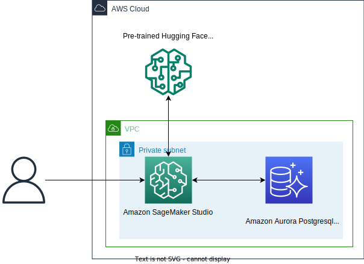

# Semantic Vector Search Application CDK Python project!



This is a CDK Python project that uses SageMaker and Aurora Postgresql to build a semantic vector search application.

The `cdk.json` file tells the CDK Toolkit how to execute your app.

This project is set up like a standard Python project.  The initialization
process also creates a virtualenv within this project, stored under the `.venv`
directory.  To create the virtualenv it assumes that there is a `python3`
(or `python` for Windows) executable in your path with access to the `venv`
package. If for any reason the automatic creation of the virtualenv fails,
you can create the virtualenv manually.

To manually create a virtualenv on MacOS and Linux:

```
$ python3 -m venv .venv
```

After the init process completes and the virtualenv is created, you can use the following
step to activate your virtualenv.

```
$ source .venv/bin/activate
```

If you are a Windows platform, you would activate the virtualenv like this:

```
% .venv\Scripts\activate.bat
```

Once the virtualenv is activated, you can install the required dependencies.

```
(.venv) $ pip install -r requirements.txt
```

To add additional dependencies, for example other CDK libraries, just add
them to your `setup.py` file and rerun the `pip install -r requirements.txt`
command.

Before synthesizing the CloudFormation, you should set approperly the cdk context configuration file, `cdk.context.json`.

For example:

```
{
  "db_cluster_name": "postgresql-cluster-name"
}
```

Now this point you can now synthesize the CloudFormation template for this code.

```
(.venv) $ export CDK_DEFAULT_ACCOUNT=$(aws sts get-caller-identity --query Account --output text)
(.venv) $ export CDK_DEFAULT_REGION=us-east-1 # your-aws-account-region
(.venv) $ cdk synth --all
```

Now we will be able to deploy all the CDK stacks at once like this:

```
(.venv) $ cdk deploy --require-approval never --all
```

Or, we can provision each CDK stack one at a time like this:

#### Step 1: List all CDK Stacks

```
(.venv) $ cdk list
VectorSearchVpcStack
VSPgVectorStack
VSSageMakerStudioStack
```

#### Step 2: Create Aurora Postgresql cluster

```
(.venv) $ cdk deploy --require-approval never VectorSearchVpcStack VSPgVectorStack
```

#### Step 3: Create SageMaker Studio

```
(.venv) $ cdk deploy --require-approval never VSSageMakerStudioStack
```

**Once all CDK stacks have been successfully created, proceed with the remaining steps of the [overall workflow](../README.md#overall-workflow).**


## Clean Up

Delete the CloudFormation stacks by running the below command.

```
(.venv) $ cdk destroy --all
```

## Useful commands

 * `cdk ls`          list all stacks in the app
 * `cdk synth`       emits the synthesized CloudFormation template
 * `cdk deploy`      deploy this stack to your default AWS account/region
 * `cdk diff`        compare deployed stack with current state
 * `cdk docs`        open CDK documentation

Enjoy!

## References

 * [Building AI-powered search in PostgreSQL using Amazon SageMaker and pgvector (2023-05-03)](https://aws.amazon.com/blogs/database/building-ai-powered-search-in-postgresql-using-amazon-sagemaker-and-pgvector/)
     * [aws-samples/rds-postgresql-pgvector](https://github.com/aws-samples/rds-postgresql-pgvector)
 * [Extension versions for Amazon Aurora PostgreSQL](https://docs.aws.amazon.com/AmazonRDS/latest/AuroraPostgreSQLReleaseNotes/AuroraPostgreSQL.Extensions.html)
 * [Securing Amazon SageMaker Studio connectivity using a private VPC (2020-10-22)](https://aws.amazon.com/blogs/machine-learning/securing-amazon-sagemaker-studio-connectivity-using-a-private-vpc/)
 * [Connect SageMaker Studio Notebooks in a VPC to External Resources](https://docs.aws.amazon.com/sagemaker/latest/dg/studio-notebooks-and-internet-access.html)
 * [How can I troubleshoot the InternalServerError response on Amazon SageMaker? - AWS re:Post](https://repost.aws/knowledge-center/sagemaker-http-500-internal-server-error)
